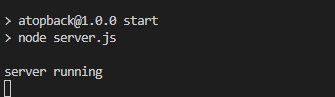
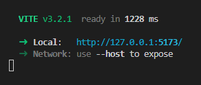
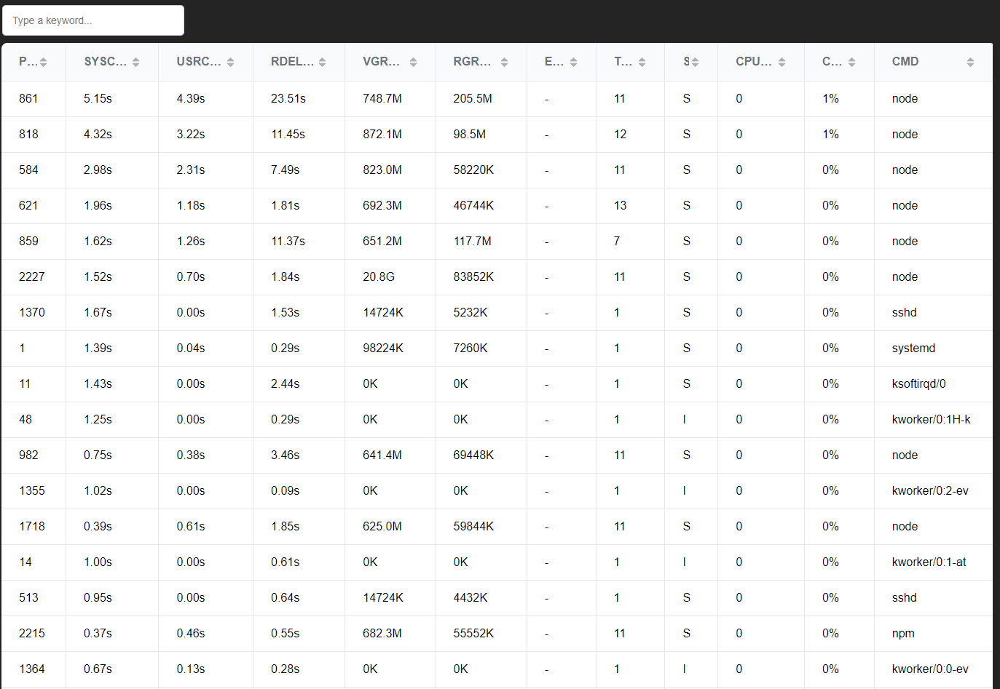

# visualAtop

visualAtop is a webTool for visalise the output of Atop tool in a webpage

## About [Atop](https://www.atoptool.nl)
The atop command is a tool for monitoring system resources in Linux. It displays tons of information related to the amount of load on the system's resources at the process level.

Checkout atop website [atop](https://www.atoptool.nl)

## Pre-Requirement
Atop should be already installed in the system.

### Install atop on RHEL/CentOS/Fedora Linux
```sh
dnf install atop
```
or
```sh
yum install atop
```
### Install atop on Debian/Ubuntu Linux
```sh
apt install atop
```

## Installation
Installation has two parts

### 1. Clone the project
```sh
git clone https://github.com/sachhu/visualAtop.git
cd visualAtop
npm install
```
### 2. Installing backend
```sh
cd api
npm start
```

### 3. Installing frontend
```sh
cd frontend
npm run dev
```


Open any web browner and run open the url http://127.0.0.1:\<port>

and click on "RUN" button



## Pull requests are welcome
Clone the repo and make a branch from "dev" branch
```sh
git checkout -b newBranch dev
```
Show your magic in "newBranch" and create a pull request on "dev" branch